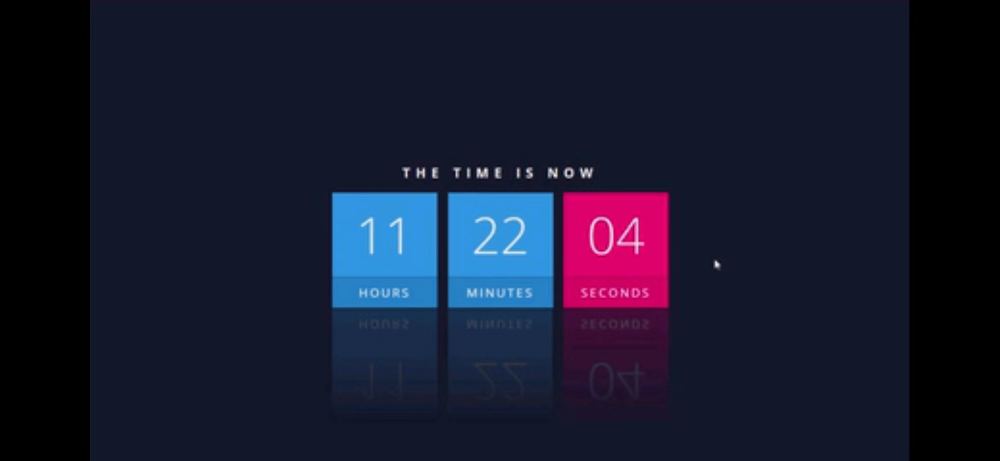

<!--
 * @Description: 
 * @version: 
 * @Author: lxw
 * @Date: 2019-12-31 09:35:30
 * @LastEditors  : lxw
 * @LastEditTime : 2019-12-31 14:21:10
 -->
#### 使用js、css3 以及 flex布局实现的一个居中，时钟特效

ps：仿照youtub的一个教程实现

#### 涉及以下知识点
1. css3提供的新特性-webkit-box-reflect属性(以谷歌浏览器为代表的Webkit渲染引擎独有的特征)实现镜像倒影，加前缀，只能使用在webkit引擎的浏览器。
 - [参考](https://www.cnblogs.com/my-freedom/p/6825871.html)
 - [兼容各种浏览器的倒影效果](https://blog.csdn.net/afeiqiang/article/details/8441618)
 - 倒影模糊渐变： 
  ```
  -webkit-box-reflect: below 10px -webkit-gradient(linear, left top, left bottom, from(transparent), to(rgba(250, 250, 250, 0.7)));
  ```
2. flex快速的水平垂直居中布局
3. 引入第三方字体,并且进行使用
3. 其他一些css属性，比如
  - text-transform:设置英文单词的大小写形式，比如文本英文单词全部设置为小写或者大小或者是每一个单词开头都大写
  - letter-spacing：设置单词字母之间的间隔
  - 单位：em、px、rem的联系与区别
  > - 都是计量单位，px是css中定义的像素，优点是简单方便，同时利用px设置的字体以及元素宽高等比较稳定和精确。缺点是无法适应浏览器缩放时产生的变化，固定了大小
  > - em是相对尺寸，一般多用于设置字体以及与字体相关的尺寸比如字母间的间距。其相对于当前对象内文本的font-size，如果对象文本内文本的font-size也是设置em那它是相对于父元素文本的font-size设置的，所以em可以较好的响应设备屏幕尺寸的变化。但是在进行元素设置时都需要知道父元素文本的font-size及当前对象内文本的font-size。
  > - rem也表示相对尺寸，其参考对象为根元素<html>的font-size，因此只需要确定这一个font-size。
  > 补充，px是css像素不同于实际的物理像素，早期电脑屏幕中的物理像素与css像素是相同的。后期出现了高精度屏幕，为此移动浏览器以及某些桌面浏览器引入了devicePixelRatio：物理像素与设备独立像素的比例。也就是 devicePixelRatio = 物理像素 / 独立像素。而css像素=独立像素，由此我们可以得出 devicePixelRatio = 物理像素 / css像素，进而可以推算出该设备上一个css像素代表几个物理像素。例如iPhone的retina屏的devicePixelRatio = 2，那么该设备上一个css像素相当于2个物理像素。**比如移动端适配方案的rem布局就是利用这个dpr属性，不同设备的dpr属性不同。**
4. js
 - 封装一个clock时钟模块
    > 时钟功能：从秒开始计时，返回的是对应的 xx-xx-xx格式字符串
    > 使用说明:
    >  - 封装一个时间倒计时的模块autoClock：通过回调函数返回 小时 + 分钟 + 秒数
    >  - 接收一个obj参数：{hours:,minutes:,seconds:}，需要设置哪一个参数就设置哪一个比如{hours:12}小时就从12开始，默认都是从当前时间开始
    >  - 接收一个一个回调函数，使用回调函数把信息返回到需要的地方可以实现更高的灵活性，你可以根据你的业务需要在回调函数里面执行相关的业务逻辑
